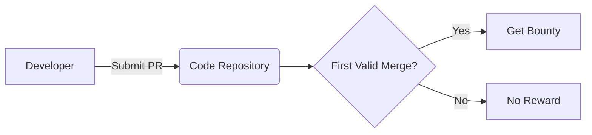
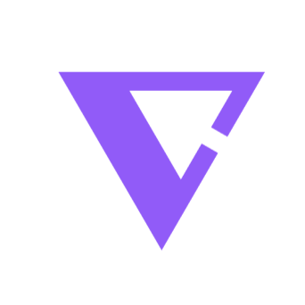

# 🪙 VGrant - ETHGlobal

## Protocols

## Prizes 🥇
### Partners
#### Vlayer 
**VLayer** provides verifiable data infrastructure that bridges Web2 and Web3, enabling developers to integrate and verify real-world data—like web and email proofs—into Ethereum smart contracts using zero-knowledge proofs and familiar tools like Solidity.

#### World 
**World** offers developers a chance to build mini-apps with instant access to 23 million World App users, featuring integrated wallets and free transactions on World Chain, while providing bounties for projects using their Minikit SDK.

### Our prizes
We register for the following prizes :
- Vlayer
    🦸 Most inspiring use of vlayer superpowers ⸺ $4,000\
    📧 Best use of Email Proofs ⸺ $2,000
- World\
    📲 Best Mini App ⸺ $10,000

## Potential upgrade
- IPFS
- Manage multiple concensus - Fund on merge / Fund on merge and approval (Bounty / Free-lance)
- Add bounty on existing issues