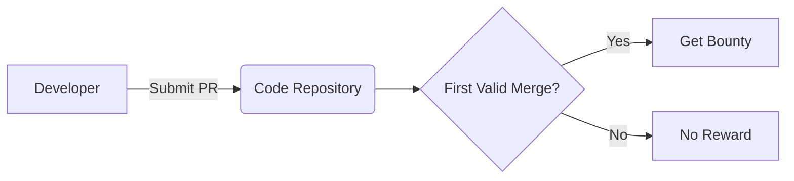

  

# 🪙 VGrant - ETHGlobal

## Protocols

## Prizes 🥇
### Partners

  

**VLayer** provides verifiable data infrastructure that bridges Web2 and Web3, enabling developers to integrate and verify real-world data—like web and email proofs—into Ethereum smart contracts using zero-knowledge proofs and familiar tools like Solidity.

#### World 

  

**World** offers developers a chance to build mini-apps with instant access to 23 million World App users, featuring integrated wallets and free transactions on World Chain, while providing bounties for projects using their Minikit SDK.

### Registration
We register for the following prizes :
#### Vlayer
- 🦸 Most inspiring use of vlayer superpowers $4,000
- 📧 Best use of Email Proofs $2,000
#### World
- 📲 Best Mini App $10,000

## Potential upgrade
- IPFS
- Manage multiple concensus - Fund on merge / Fund on merge and approval (Bounty / Free-lance)
- Add bounty on existing issues