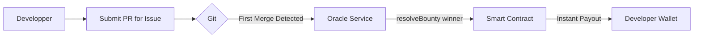

# 🪙 vGrant - Fund-on-Merge Crypto Bounty System

### ETHGlobal Pragma 2024 Submission

[](https://ethglobal.com/events/prague)

> **Bounties with autonomous, trustless payouts**  
Zero approvals · PR theft protection · First-merge-wins mechanics

---

**vGrant** is a decentralized bounty platform that enforces **`Fund on Merge`** consensus, automating crypto payments to developers upon first valid code integration while eliminating payment delays, manual approvals, and PR theft through zero-knowledge verification.

### Fund on Merge concensus

```mermaid
graph LR
    F[💸 Funder]
    D[👨‍💻 Developer]

    F -->|1 - Fund Bounty| C[📜 Smart Contract]
    D -->|2 - Submit PR| G[🐙 Git]
    G -->|3 - First Merge| C
    C -->|4 - Auto-Payout| D
    
    style C fill:#e6f7ff,stroke:#1890ff,stroke-width:2px
    style F fill:#f6ffed,stroke:#52c41a
    style D fill:#fff7e6,stroke:#fa8c16
    style G fill:#f9f0ff,stroke:#722ed1
```


## User Story
**Alice** 👩‍💼 needs a **Blender** feature her team can't build. She:
1. Creates GitHub issue [#1234]()
2. Highlight by funding **USDC** bounty (escrow) with deadline + early bonus

**Bob** 👨‍💻 wants paid open source work. He:
1. Finds **Alice**'s issue via bounty board
2. Submit a solution via **Pull-Request** (Code + tests + docs).

**Maintainer** 🤵‍♂️:
1. Reviews **Bob**'s Pull-Request against standard
2. Merges on approval → **auto-releases payment**


## ✅ When **bounties** beat classic model: 
- **Funder**: Pays only for results (no hourly fees/management)
- **Developper**: Earns crypto-currencies + reputation
- **Blender**: Gets vetted code faster
- **0% platform fees** (vs. 20% on Upwork/Fiverr)
- **Decentralized**: No geo-restrictions/censorship

## ❌ When it does not:
- **Complex projects**: Poor for multi-phase work needing iteration
- **Relationship-dependent**: Bad when ongoing collaboration required 
- **Sensitive work**: Unsuitable for proprietary/NDA-protected code
- **High-support features**: Suboptimal if post-launch maintenance needed
- **Niche skills**: Less effective than targeted freelancer recruitment

## 🚀 How VGrant Works

### ⭐ Funder Journey
A **Funder** creates bounties for desired features:

```mermaid
graph LR
    A[💸 1. Create Bounty] --> B[Define Specs & Deadline]
    B --> C[🔒 2. Lock USDC in Escrow]
    C --> D[🔄 3. Open Bounty]
    D --> E{Resolution}
    E -->|First Valid Merge| F[🟢 4a. Auto-Payout]
    E -->|Deadline Reached| G[🔴 4b. Auto-Refund]
    F --> H[✅ Bounty Closed]
    G --> H
```



1. **Create Bounty**  
```solidity
struct Bounty {
    address payable funder;
    address token;  // USDC: 0xA0b8... 
    uint256 amount;
    uint256 deadline;
    bool isClaimed;
}
```

2. **Deposit Funds**  
- **USDC** held in audited escrow contract
- Immutable until resolution conditions met

3. **Automatic Resolution**  
- 🟢 **Success**: Contract auto-sent to first merged PR
- 🔴 **Timeout**: Funder refund after deadline

### 👨‍💻 Developer Journey

The first valid merge can claim the Bounty 💸



## ✨ Core Innovation

### 🛡️ PR Theft Protection

```mermaid
graph LR
    A[Pull Request Created] --> B{VLayer Verification}
    B -->|Valid Email 📧| C[✅ Secure Payout]
    B -->|Invalid| D[❌ Rejected]
```


- **ZK-Proof Verification** (VLayer integration)
- Cryptographic GitHub signature validation
- Immutable merge timestamp proof

---

### 🔑 Key Benefits
| **Feature**         | **💸 Funder**                  | **👨‍💻 Developer**               |
|---------------------|-----------------------------------|-----------------------------------|
| **Winner Selection**| Algorithmic - no bias            | Pure meritocracy win         |
| **Fund Handling**   | Reclaim anytime post-deadline    | Instant payout on merge
| **Technical Focus** | Define problem → fund → wait      | Find issue → code → get paid      |

---

## 🏆 Prize Integrations
### 📽️ Partners


**VLayer** provides verifiable data infrastructure that bridges Web2 and Web3, enabling developers to integrate and verify real-world data — **like web and email proofs** — into Ethereum smart contracts using zero-knowledge proofs and familiar tools like Solidity.

**Email Proof Integration:**
```solidity
function verifyResolution(
    bytes32 issueId,
    EmailProof memory proof
) external {
    require(VLayer.verifyEmail(proof), "Invalid proof");
    _processPayout(issueId);
}
```

- **ZK-verified contributor identities**
- Anti-sybil protection for submissions
- Secure multi-platform notifications

---


**World** offers developers a chance to build mini-apps with instant access to 23 million World App users, featuring integrated wallets and free transactions on World Chain, while providing bounties for projects using their Minikit SDK.

**In-App Bounty Discovery:**
```javascript
WorldSDK.connectWallet();
const bounties = await WorldSDK.getLiveBounties();
```

- Instant access to 23M World App users
- Gasless transactions via World Chain
- Embedded wallet integration


## 🏅 [Prize](https://ethglobal.com/events/prague/prizes#world) Submissions

| Prize                          | Category                  | Value    |
|--------------------------------|---------------------------|----------|
| **VLayer**                     | Most inspiring use        | $4,000   |
| **VLayer**                     | Best Email Proofs         | $2,000   |
| **World**                      | Best Mini App             | $10,000  |


## Potential upgrade
- Implement decentralized database for front-end caching (using **IPFS**)
- Manage multiple concensus - **Fund on merge** / **Fund on merge and Approval** (Bounty / Free-lance concensus)
- Add other Git service (Gitlab, ...)