# 🪙 VGrant - First-Merge-Wins Crypto Bounty System
### ETHGlobal Pragma 2024 Submission

[](https://ethglobal.com/events/prague)

> **Bounties with autonomous, trustless payouts**  
Zero approvals · PR theft protection · First-merge-wins mechanics

## 🚀 How VGrant Works

### ⭐ Funder Journey

```mermaid
graph LR
    A[Funder] -->|createBounty| B[Lock Funds]
    B --> C{Open Bounty}
    C -->|First Valid Merge| D[🟢 Auto-Payout]
    C -->|Deadline Expired| E[🔴 Reclaim]
    D --> F[Bounty Closed]
    E --> F
```



1. **Create Bounty**  
   - Initialize with GitHub issue ID
   - Set expiration timeframe (days/weeks)
   ```solidity
   struct Bounty {
       address payable funder;
       uint96 amount;          // Packed storage
       uint32 deadline;        // Until 2106
       address winner;
       bool isClaimed;
   }
   ```

2. **Deposit Funds**  
   - ETH/ERC-20 held in non-custodial escrow
   - Fully refundable if unresolved

3. **Automatic Resolution**  
   - 🟢 **Success**: Funds auto-sent to first merged PR
   - 🔴 **Timeout**: Manual reclaim after deadline

### 👨‍💻 Developer Journey
The first valid merge can claim the Bounty 💸 


## ✨ Core Innovation

### 🛡️ PR Theft Protection

```mermaid
graph LR
    A[PR Created] --> B{Oracle Verification}
    B -->|Valid Email| C[✅ Secure Payout]
    B -->|Invalid| D[❌ Rejected]
```


- **ZK-Proof Verification** (VLayer integration)
- Cryptographic GitHub signature validation
- Immutable merge timestamp proof

---

### 💸 Funder Benefits:
1. **Minimal Management**  
   - No developer approvals
   - No PR tracking
   - No dispute resolution

2. **Cost Control**  
   - Fixed bounty amount
   - Guaranteed refund if unresolved
   - No gas costs after creation

3. **Transparent Process**  
   - Winner determined automatically
   - Payout publicly verifiable
   - Deadline enforced by contract

This simplified funder journey maintains security while minimizing management overhead through automated payout mechanics and guaranteed fund recovery.

---

## 🏆 Prize Integrations
### 📽️ Partners


**VLayer** provides verifiable data infrastructure that bridges Web2 and Web3, enabling developers to integrate and verify real-world data — **like web and email proofs** — into Ethereum smart contracts using zero-knowledge proofs and familiar tools like Solidity.

**Email Proof Integration:**
```solidity
function verifyResolution(
    bytes32 issueId,
    EmailProof memory proof
) external {
    require(VLayer.verifyEmail(proof), "Invalid proof");
    _processPayout(issueId);
}
```

- **ZK-verified contributor identities**
- Anti-sybil protection for submissions
- Secure multi-platform notifications

---


**World** offers developers a chance to build mini-apps with instant access to 23 million World App users, featuring integrated wallets and free transactions on World Chain, while providing bounties for projects using their Minikit SDK.

**In-App Bounty Discovery:**
```javascript
WorldSDK.connectWallet();
const bounties = await WorldSDK.getLiveBounties();
```

- Instant access to 23M World App users
- Gasless transactions via World Chain
- Embedded wallet integration


## 🏅 Prize Submissions
[Prizes](https://ethglobal.com/events/prague/prizes#world)

| Prize                          | Category                  | Value    |
|--------------------------------|---------------------------|----------|
| **VLayer**                     | Most inspiring use        | $4,000   |
| **VLayer**                     | Best Email Proofs         | $2,000   |
| **World**                      | Best Mini App             | $10,000  |


## Potential upgrade
- IPFS
- Manage multiple concensus - Fund on merge / Fund on merge and approval (Bounty / Free-lance)
- Add bounty on existing issues
- Add other Git service (Gitlab, ...)