# 🪙 vGrant - Fund-on-Merge Crypto Bounty System

### [ETHGlobal Prague 2025](https://ethglobal.com/events/prague) Submission

[](https://ethglobal.com/events/prague)

> **Grants with autonomous, trustless payouts**  
Zero approvals · PR theft protection · First-merge-wins mechanics

---

**vGrant** is a decentralized grant platform that enforces **`Fund on Merge`** consensus (See below), automating crypto payments to developers upon first valid code integration while eliminating payment delays, manual approvals, and PR theft through zero-knowledge verification.

### Fund on Merge Concensus

```mermaid
graph LR
    F[💸 Funder]
    D[👨‍💻 Developer]

    F -->|1 - Fund Grant| C[📜 Smart Contract]
    D -->|2 - Submit PR| G[🐙 Git]
    G -->|3 - First Merge| C
    C -->|4 - Auto-Payout| D
    
    style C fill:#e6f7ff,stroke:#1890ff,stroke-width:2px
    style F fill:#f6ffed,stroke:#52c41a
    style D fill:#fff7e6,stroke:#fa8c16
    style G fill:#f9f0ff,stroke:#722ed1
    classDef default fill:none,stroke:none,color:black
```


## User Story
**Alice** 👩‍💼 needs a **Blender** feature her team can't build. She:
1. Creates GitHub issue [#1234]()
2. Highlight by funding [**USDC**](https://coinmarketcap.com/currencies/usd-coin/) grant (Vault escrow) with deadline

**Bob** 👨‍💻 wants paid open source work. He:
1. Finds **Alice**'s issue via grant board
2. Submit a solution via **Pull-Request** (Code + tests + docs).

**Maintainer** 🤵‍♂️:
1. Reviews **Bob**'s Pull-Request against standard
2. Merges on approval → **auto-releases payment**
3. Receives review fee (5-15% of grant) → funds project treasury

## 🚀 How VGrant Works

### ⭐ Funder Journey
A **Funder** creates grant for desired features:

```mermaid
graph LR
    A[💸 1. Create Grant] --> B[Define Specs & Deadline]
    B --> C[🔒 2. Lock USDC in Escrow]
    C --> D[🔄 3. Open Grant]
    D --> E{Resolution}
    E -->|First Valid Merge| F[🟢 4a. Auto-Payout]
    E -->|Deadline Reached| G[🔴 4b. Auto-Refund]
    F --> H[✅ Grant Closed]
    G --> H
```



1. **Create Grant** : Remunerate Open Source Projects and Contributors
```solidity
struct Grant {
    address payable funder;
    address token;  // USDC: 0xA0b8... 
    uint256 amount;
    uint256 deadline;
    bool isClaimed;
}
```

2. **Funds Locking**  
- **USDC** held in audited vault contract
- Immutable until resolution conditions met

3. **Automatic Resolution**  
- 🟢 **Success**: Contract auto-sent to first merged PR
- 🔴 **Timeout**: Funder refund after deadline

### 👨‍💻 Developer Journey
A **Developer** can work on available granted issues.
The first valid merge claim the Grant 💸

```mermaid
flowchart LR
    A[👨‍💻 1 - Find Grant] --> R[🛡️ 2 - Link Git account and wallet using **vGrant**]
    R --> B[3 - Submit PR with Solution]
    B --> C[4 - Maintainer Reviews]
    C --> D{5 - Approved?}
    D -->|Yes| E[6 - Merge PR]
    D -->|No| B
```


## ✨ Core Innovation

### 🛡️ PR Theft Protection
By using the **Web Proof** technology of **vlayer**, we ensure a **Git Account** is linked to a **Wallet Address** by enforcing a registration of the developer before a valid merge (*Step 2. in above diagram*). We use our **front-end** to simplify the interaction with our smart contract.

```mermaid
graph LR
    A[Resolved Issue] --> B{Has issuer registered}
    B -->|Valid Git account| C[💸 - Instant USDC Payout]
    C --> L[✅ Grant Claimed]
    B -->|No Valid User| D[🛑 - Claim Rejected]
    D --> M[⚠️ Grant Pending - Alert Maintainers]

```




- [**Zero-Knowledge-Proof Verification**](https://en.wikipedia.org/wiki/Zero-knowledge_proof) (VLayer integration)

---

## 🔑 Key Benefits
| **Feature**         | **💸 Funder**                  | **👨‍💻 Developer**               |
|---------------------|-----------------------------------|-----------------------------------|
| **Winner Selection**| Algorithmic - no bias            | Meritocracy win         |
| **Fund Handling**   | Reclaim anytime post-deadline    | Instant payout on merge
| **Technical Focus** | Define problem → fund → wait      | Find issue → code → get paid      |


### ✅ When **Grants** beat classic models: 
- **Funder**: Pays only for results (no hourly fees/management)
- **Developper**: Earns remuneration and reputation
- **Blender**: Gets vetted code faster

### ❌ When Traditional Wins:
- **Complex projects**: Poor for multi-phase work needing iteration
- **Relationship-dependent**: Bad when ongoing collaboration required 
- **Sensitive work**: Unsuitable for proprietary/NDA-protected code
- **High-support features**: Suboptimal if post-launch maintenance needed
- **Niche skills**: Less effective than targeted freelancer recruitment

## When to use Bounties ?
#### ⭐ For Funder
- Scope is **clear** & **achievable** (1-3 week tasks)
- Seeking specialized skills for **non-core features**
- Budget certainty outweighs timeline flexibility
- Funds released only for verified working solutions

#### 👨‍💻 For Developper
- Be rewarded for your Open Source Work in your **Free Time**
- Build a **Reputation** with contributions (Git/NFTs)
- Compete on skill, **not location**
- Access global opportunities with no interviews

#### 🤵‍♂️ For Maintainer 
- Project benefits from new vetted contributions
- Quality control is enforced (verified before merge)
- Earn sustainable funding (percentage of bounties)
- Grow ecosystem through new contributors

## 🌐 Why Decentralizing it ?
- **0% platform fees** (vs. 20% on Upwork/Fiverr)
- **Decentralized**: No geo-restrictions/censorship
- **Transparency**: Verifiable on-chain contract

---

## 🏆 Prize Integrations
### 📽️ Partners


**VLayer** provides verifiable data infrastructure that bridges Web2 and Web3, enabling developers to integrate and verify real-world data — **like web and email proofs** — into Ethereum smart contracts using zero-knowledge proofs and familiar tools like Solidity.

- **ZK-verified contributor identities**
- Anti-sybil protection for submissions

## 🏅 [Prize](https://ethglobal.com/events/prague/prizes#world) Submissions

| Prize                          | Category                  | Value    |
|--------------------------------|---------------------------|----------|
| **VLayer**                     | Most inspiring use        | $4,000   |
| **VLayer**                     | Best Web Proofs           | $2,000   |


## Potential upgrade
- Implement decentralized database for front-end caching (using **IPFS**)
- Manage multiple concensus - **Fund on merge** / **Fund on merge and Approval** (Grant / Free-lance concensus)
- Add other Git service (Gitlab, ...)
- Add developper portfolio
- Priority ranking in Project
- Add early bonus in the protocol