# 🪙 VGrant - First-Merge-Wins Crypto Bounty System
### ETHGlobal Pragma 2024 Submission

[](https://ethglobal.com/events/prague)

> **Bounties with autonomous, trustless payouts**  
Zero approvals · PR theft protection · First-merge-wins mechanics

## 🚀 How VGrant Works

### ⭐ Funder Journey

```mermaid
graph LR
    A[Funder] -->|createBounty| B[Lock Funds]
    B --> C{Open Bounty}
    C -->|First Valid Merge| D[🟢 Auto-Payout]
    C -->|Deadline Expired| E[🔴 Reclaim]
    D --> F[Bounty Closed]
    E --> F
```




1. **Create Bounty**
- Initialize bounty with unique issue ID
- Set expiration timeframe
```solidity
struct Bounty {
        address payable funder;
        uint96 amount;
        uint32 deadline;
        address winner;
        bool isClaimed;
}
```

2. **Deposit Funds**
- Lock cryptocurrency in smart contract- 
- Funds held in escrow

3. **Wait for Resolution**
- Two possible outcomes:

```mermaid
graph LR
    W[Wait] -->|Successful Fix| S[🟢 Auto-Payout]
    W -->|Timeout| T[🔴 Reclaim]
```

4. **Resolution Paths**  
   - 🟢 **Auto-Payout to Winner** (Green path):
     - Triggered by first valid merge
     - Funds automatically transferred
     - No funder action required
   - 🔴 **Reclaim Funds** (Red path):
     - Manual `reclaimBounty()` call
     - Available after deadline
     - Full refund

5. **Bounty Closed**  
   - Contract state finalized
   - Event emitted for record keeping


### 👨‍💻 Developer Journey


**Winner Determination**  

```mermaid
graph LR
    PR[Pull Request] -->|Merged| Detect{First Valid Merge?}
    Detect -->|Yes| Win[💸 Claim Bounty]
    Detect -->|No| Continue[Keep Contributing]
```



### Timeline Visualization:


### Funder Benefits:
1. **Minimal Management**  
   - No developer approvals
   - No PR tracking
   - No dispute resolution

2. **Cost Control**  
   - Fixed bounty amount
   - Guaranteed refund if unresolved
   - No gas costs after creation

3. **Transparent Process**  
   - Winner determined automatically
   - Payout publicly verifiable
   - Deadline enforced by contract

This simplified funder journey maintains security while minimizing management overhead through automated payout mechanics and guaranteed fund recovery.

---


## 📽️ Partners


**VLayer** provides verifiable data infrastructure that bridges Web2 and Web3, enabling developers to integrate and verify real-world data — **like web and email proofs** — into Ethereum smart contracts using zero-knowledge proofs and familiar tools like Solidity.


**World** offers developers a chance to build mini-apps with instant access to 23 million World App users, featuring integrated wallets and free transactions on World Chain, while providing bounties for projects using their Minikit SDK.


## 🏅 Prize Submissions
[Prizes](https://ethglobal.com/events/prague/prizes#world)

| Prize                          | Category                  | Value    |
|--------------------------------|---------------------------|----------|
| **VLayer**                     | Most inspiring use        | $4,000   |
| **VLayer**                     | Best Email Proofs         | $2,000   |
| **World**                      | Best Mini App             | $10,000  |


## Potential upgrade
- IPFS
- Manage multiple concensus - Fund on merge / Fund on merge and approval (Bounty / Free-lance)
- Add bounty on existing issues