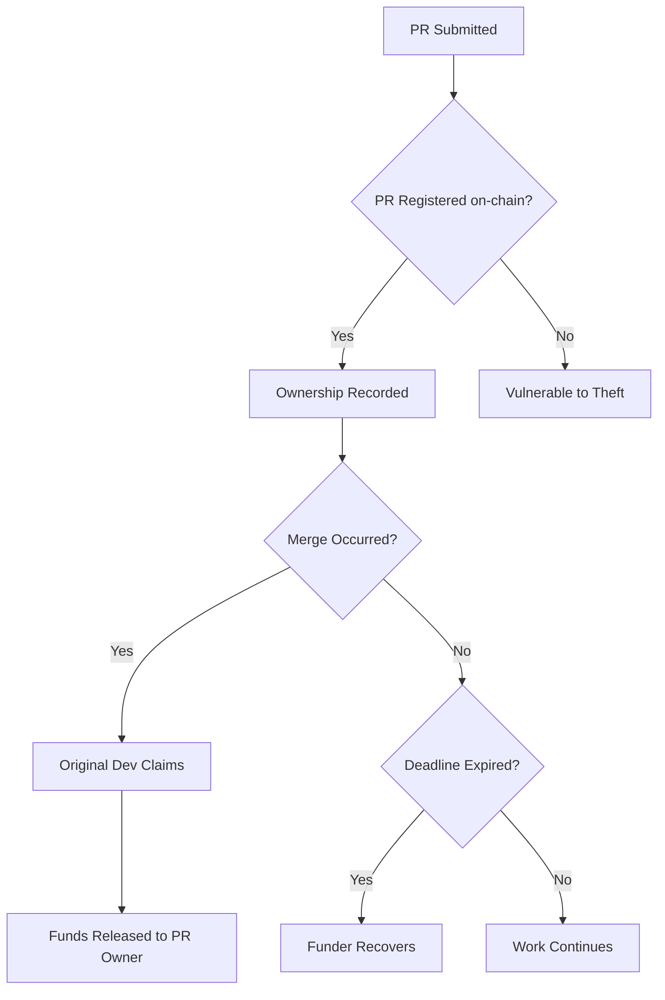
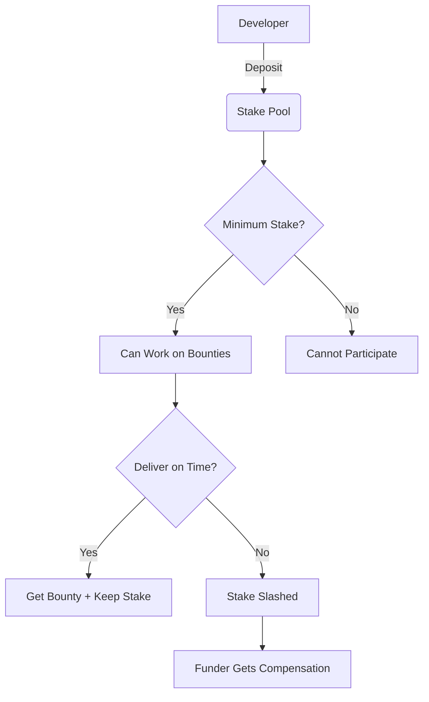

# PR Workflow

```mermaid
graph TD
    A[PR Submitted] --> B{PR Registered on-chain?}
    B -->|Yes| C[Ownership Recorded]
    B -->|No| D[Vulnerable to Theft]
    C --> E{Merge Occurred?}
    E -->|Yes| F[Original Dev Claims]
    E -->|No| G{Deadline Expired?}
    G -->|Yes| H[Funder Recovers]
    G -->|No| I[Work Continues]
    F --> J[Funds Released to PR Owner]
```

# Staking mechanism
### Variable Minimum Stake:
- Set per bounty by funder
- Higher stakes for critical issues
- Lower stakes for simple tasks

```mermaid
graph TD
    A[Developer] -->|Deposit| B(Stake Pool)
    B --> C{Minimum Stake?}
    C -->|Yes| D[Can Work on Bounties]
    C -->|No| E[Cannot Participate]
    D --> F{Deliver on Time?}
    F -->|Yes| G[Get Bounty + Keep Stake]
    F -->|No| H[Stake Slashed]
    H --> I[Funder Gets Compensation]
```