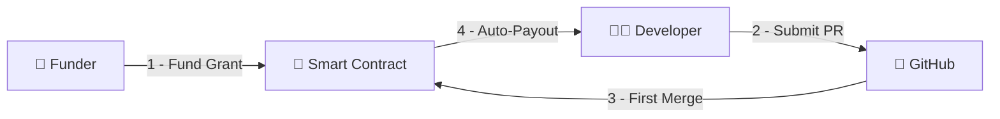
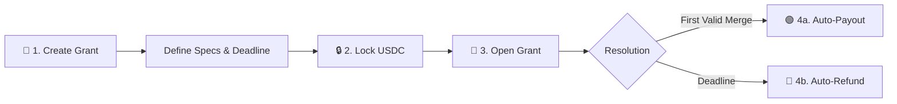
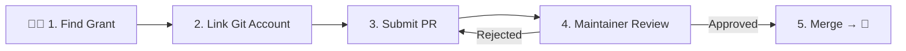
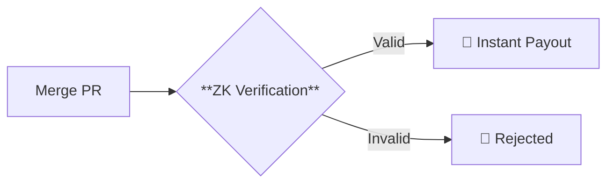

# ⚡ vGrant  
## Fund-on-Merge Crypto Bounty System

Zero approvals · PR theft protection · First-merge-wins mechanics

<!-- 
Focus on:
- Autonomous payouts
- PR theft protection
- First-merge-wins mechanics
-->

---
layout: top-title
color: blue
---

:: title ::
# 🚀 vGrant Overview
:: content :: 

**Grants with autonomous, trustless payouts**  
Automated crypto payments upon first valid code integration



---
layout: top-title
color: green
---

:: title ::
# 👥 User Story
:: content ::

<v-switch>
<template #0>

**Alice** 👩‍💼 (Funder):
1. Creates GitHub issue [#1234]()
2. Funds grant with USDC + deadline

</template>

<template #1>

**Bob** 👨‍💻 (Developer):
1. Finds issue via grant board
2. Submits solution via PR

</template>

<template #2>

**Maintainer** 🤵‍♂️:
1. Reviews PR against standards
2. Merges → triggers payout
3. Earns review fee (5-15%)

</template>
</v-switch>

---
layout: top-title
color: purple
---

:: title ::
# 💸 Funder Journey
:: content ::



---
layout: top-title
color: amber
---

:: title ::
# 👨‍💻 Developer Journey
:: content ::



---
layout: top-title
color: red
---

:: title ::
# 🛡️ PR Theft Protection
:: content ::



Using VLayer's ZK-Proofs for:
- Verified contributor identities
- Anti-sybil protection
- Secure notifications

---
layout: top-title
color: teal
---

:: title ::
# ✅ Benefits Matrix
:: content ::

| **Feature**         | **💸 Funder**                  | **👨‍💻 Developer**               |
|---------------------|--------------------------------|--------------------------------|
| **Selection**       | Algorithmic - no bias          | Pure meritocracy               |
| **Payout Timing**   | Reclaim post-deadline          | Instant on merge               |
| **Focus**           | Define problem → fund          | Code → get paid                |

---
layout: top-title
color: emerald
---

:: title ::
# ⚖️ When to Use Bounties
:: content ::

<div class="grid grid-cols-2 gap-8">
<div>

**✅ Ideal For:**
- Clear scope (1-3 week tasks)
- Non-core features
- Budget certainty
- OSS contributions

</div>
<div>

**❌ Avoid For:**
- Multi-phase projects
- NDA-protected work
- High-maintenance features
- Relationship-heavy work

</div>
</div>

---
layout: top-title
color: sky-light
---

:: title ::
# 🌐 Why Decentralize?
:: content ::

- **0% platform fees** (vs 20% on Upwork)
- No geo-restrictions
- Transparent on-chain contracts
- Censorship-resistant

```go
// On-chain grant struct
type Grant struct {
    funder  common.Address
    token   common.Address // USDC
    amount  *big.Int
    deadline uint64
}
```

---
layout: top-title
color: violet
---

:: title ::
# 🏆 Prize Integrations
:: content ::

<v-switch>
<template #0>

**VLayer**  
- ZK-verified identities
- Email/Git proof verification
- $4k prize potential

```solidity
VLayer.verifyEmail(proof);
```

</template>

<template #1>

**World**  
- 23M user reach
- Gasless transactions
- $10k prize potential

```javascript
WorldSDK.getLiveBounties();
```

</template>
</v-switch>

---
layout: center
---

# 🚧 Potential Upgrades
- Multi-consensus models  
- GitLab integration  
- Developer portfolios  
- Priority ranking system  
- Early completion bonuses  

---
layout: cover
---

# 💎 vGrant  
## Autonomous Crypto Bounties

**ETHGlobal Prague 2025**  
https://github.com/your-repo  
@yourtwitter
